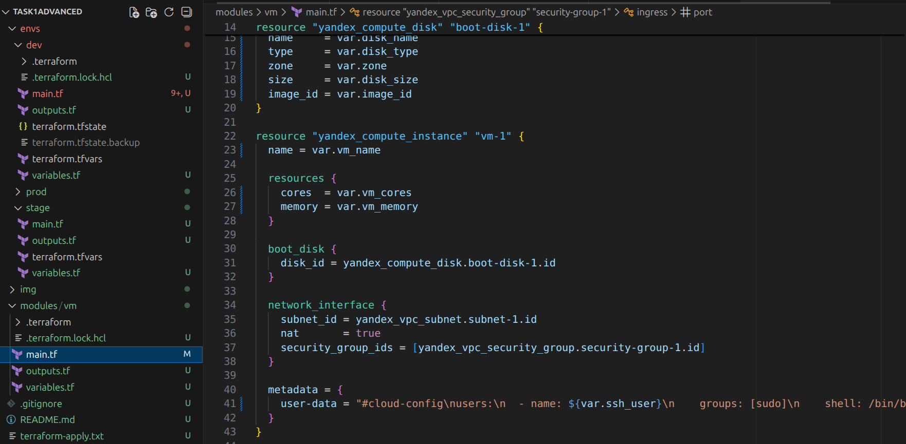
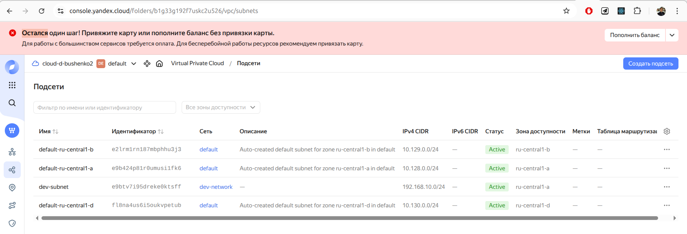
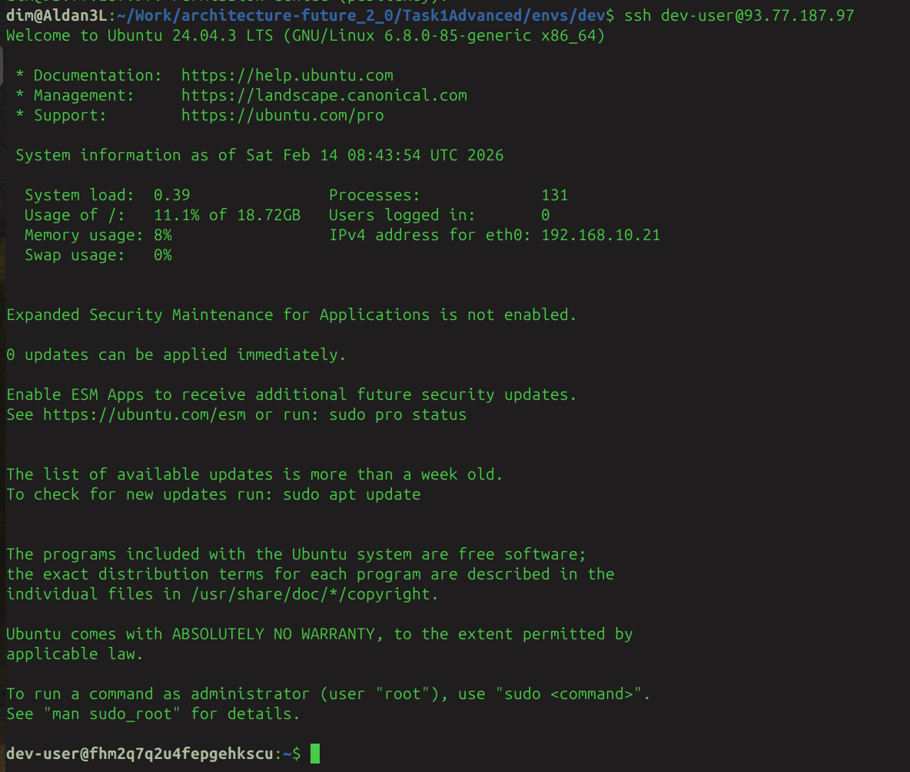

# Модульная инфраструктура для нескольких сред

Создан универсальный модуль Terraform, который можно использовать для разных окружений (dev, stage, prod). Инфраструктура развернута в Yandex Cloud.



Реализован модуль vm_module (в папке modules/vm/) со следующими параметрами:

- Количество ядер;
- Объём RAM;
- Подключаемый диск;
- Subnet ID;
- SSH-ключ.

Сформировано три окружения, каждое со своей конфигурацией:

- /envs/dev/
- /envs/stage/
- /envs/prod/

В каждом окружении использован свой .tfvars, подставляя разные параметры в модуль.

## Структура проекта

```
/TaskAdvanced1/
├── modules/
│   └── vm/
│       ├── main.tf
│       ├── variables.tf
│       └── outputs.tf
└── envs/
    ├── dev/
    │   ├── main.tf
    │   ├── variables.tf
    │   ├── outputs.tf
    │   └── terraform.tfvars
    ├── stage/
    │   ├── main.tf
    │   ├── variables.tf
    │   ├── outputs.tf
    │   └── terraform.tfvars
    └── prod/
        ├── main.tf
        ├── variables.tf
        ├── outputs.tf
        └── terraform.tfvars
```

## Запуск проекта на примере окружения *dev*

1. Перейдите в директорию окружения:
```bash
cd envs/dev
```

2. Инициализируйте Terraform:
```bash
terraform init
```

3. Проверьте план:
```bash
terraform plan
```

4. Примените конфигурацию:
```bash
terraform apply
```

Результат выполнения команды terraform apply для окружения [здесь](./terraform-apply.txt)

Созданные ресурсы:



Залогиниться можно с применением указанного в переменных публичного ключа




## Модуль vm

Модуль создает следующие ресурсы:

- Виртуальная машина (Compute Instance)
- Загрузочный диск (Compute Disk)
- Сеть (VPC Network)
- Подсеть (VPC Subnet)
- Группа безопасности (Security Group)

### Переменные модуля

| Переменная | Описание | Тип | Значение по умолчанию |
|------------|----------|-----|----------------------|
| vm_name | Имя виртуальной машины | string | "terraform-vm" |
| vm_cores | Количество ядер процессора | number | 2 |
| vm_memory | Объем памяти в ГБ | number | 2 |
| disk_name | Имя загрузочного диска | string | "boot-disk" |
| disk_type | Тип диска | string | "network-hdd" |
| disk_size | Размер диска в ГБ | number | 20 |
| image_id | ID образа для загрузочного диска | string | "fd84mnbiarffhtfrhnog" |
| zone | Зона доступности | string | "ru-central1-a" |
| network_name | Имя сети VPC | string | "network1" |
| subnet_name | Имя подсети VPC | string | "subnet1" |
| cidr_block | Блок CIDR для подсети | string | "192.168.10.0/24" |
| security_group_name | Имя группы безопасности | string | "security-group1" |
| ssh_user | Имя пользователя для SSH-доступа | string | "dim" |
| ssh_public_key | Открытый SSH-ключ для доступа пользователя | string | "" |

### Выходные значения модуля

| Выходное значение | Описание |
|-------------------|----------|
| vm_id | ID созданной виртуальной машины |
| vm_name | Имя созданной виртуальной машины |
| external_ip | Внешний IP-адрес виртуальной машины |
| internal_ip | Внутренний IP-адрес виртуальной машины |
| disk_id | ID загрузочного диска |
| network_id | ID сети VPC |
| subnet_id | ID подсети VPC |

## Окружения

Проект включает три окружения: dev, stage и prod, каждое со своими параметрами.

### Конфигурация окружений

Каждое окружение имеет:
- `main.tf` - вызывает модуль vm с нужными параметрами
- `variables.tf` - объявляет переменные, используемые в конфигурации
- `outputs.tf` - передает выходные значения из модуля
- `terraform.tfvars` - содержит специфичные для окружения значения переменных

### Параметры окружений

| Окружение | vm_cores | vm_memory | disk_size | cidr_block |
|-----------|----------|-----------|-----------|------------|
| dev | 2 | 2 | 20 | 192.168.10.0/24 |
| stage | 4 | 4 | 40 | 192.168.20.0/24 |
| prod | 8 | 8 | 100 | 192.168.30.0/24 |
