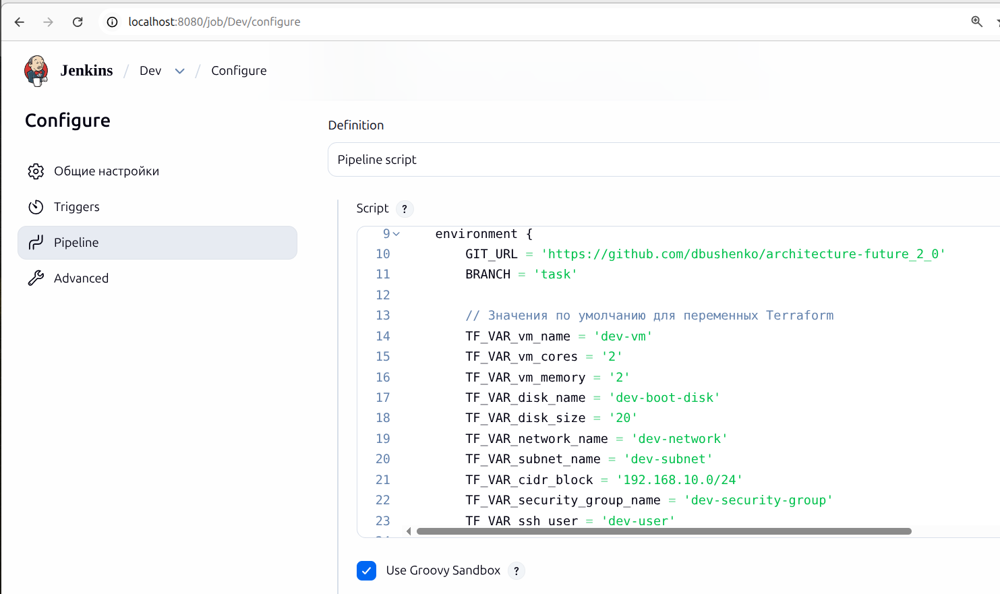
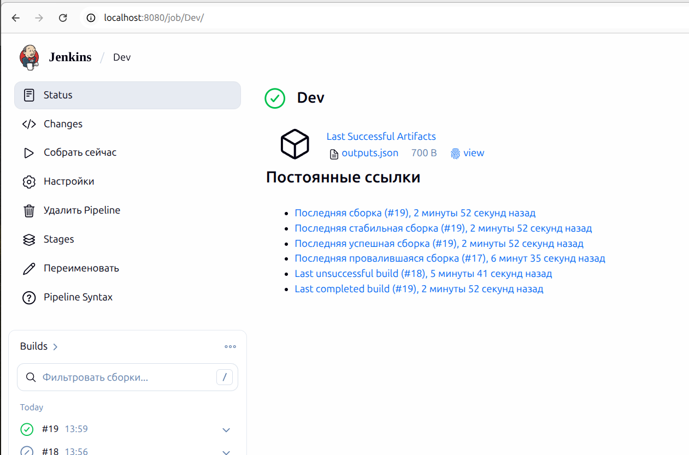
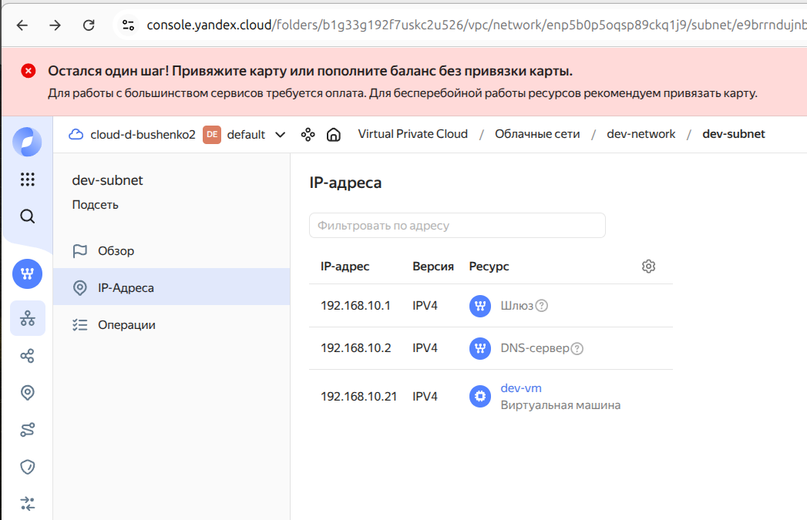
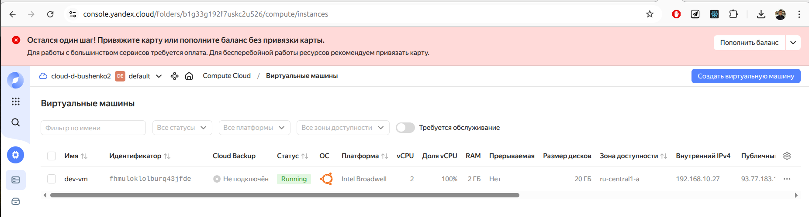

# Jenkins Pipeline для Terraform

Этот проект содержит Jenkins Pipeline для автоматизации развертывания инфраструктуры с помощью Terraform в трех средах: dev, stage и prod.

## Обзор работы Jenkins Job

### Настройка Jenkins Job



Jenkins Job скопирует репозиторий с Terraform-конфигурацией, инициализирует Terraform, проверит конфигурацию и создаст инфраструктуру в Yandex Cloud.

### Результат работы Jenkins Job



### Результат работы Terraform




### Лог работы Jenkins Job

[19](./#19.txt)

## Подготовка

1. Соберите Docker-образ агента Jenkins:

```bash
./build-image.sh
```

Команда для удаления старого образа и сборка нового:

```bash
docker rmi jenkins-agent-yc:latest
```

Докер-образ нужен для запуска Jenkins-агента с предустановленными инструментами и переменными окружения. В нем будет готовая команда terraform и переменные окружения для Yandex Cloud.

Образ агента уже содержит следующие переменные окружения:

- `YC_TOKEN` - токен для доступа к Yandex Cloud
- `YC_CLOUD_ID` - идентификатор облака
- `YC_FOLDER_ID` - идентификатор каталога

2. Установите плагины Jenkins
:
   - Docker Pipeline
   - Terraform
   - Git

3. Создайте Jenkins Job

Тип джобы -- pipeline, код следует взять из соответствующего файла Jenkinsfile.


Каждый Pipeline поддерживает следующие параметры:

- `GIT_URL` - URL репозитория для клонирования (https://github.com/dbushenko/architecture-future_2_0)
- `BRANCH` - ветка для клонирования (task)
- `VM_NAME` - имя виртуальной машины
- `VM_CORES` - количество ядер процессора
- `VM_MEMORY` - объем памяти в ГБ
- `DISK_NAME` - имя диска
- `DISK_SIZE` - размер диска в ГБ
- `NETWORK_NAME` - имя сети
- `SUBNET_NAME` - имя подсети
- `CIDR_BLOCK` - CIDR блок подсети
- `SECURITY_GROUP_NAME` - имя группы безопасности
- `SSH_USER` - имя пользователя для SSH
- `SSH_PUBLIC_KEY` - публичный SSH ключ (обязательно должен быть указан)

