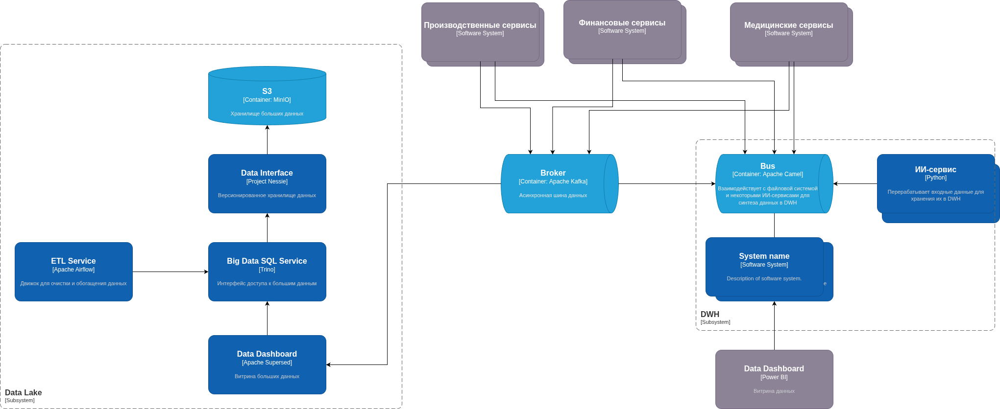

# Проектирование целевой архитектуры и оценка рисков внедрения

## Целевая архитектура

### Data Warehouse

На схеме изображена целевая архитектура в части обработки больших данных. Ранее в системе уже присутствовал DWH, построенный на базе MS SQL Server и Apache Camel, с которыми взаимодействуют различные ИИ-сревисы, написанные на Python, а также витрина данных на базе Power BI. Вероятно, нет большого смысла перерабатывать эту систему на новых технологиях, т.к. она и без того работает стабильно и удовлетворяет потребности бизнеса. Есть смысл только перенести DWH в облако, чтобы снизить затраты на инфраструктуру.

### Data Lake

С учетом того, что в компании появятся новые отделы, и ожидается значительное увеличение объема данных, было решено построить Data Lake на базе облачных технологий Yandex. В качестве хранилища данных был выбран S3 на базе MinIO, т.к. он является наиболее популярным и имеет низкую стоимость хранения данных. 

Версионизированный интерфейс к данным в S3 будет предоставлять Project Nessie, который позволит эффективно работать с большим количеством версий данных. Для работы с данными в S3 будет использоваться Apache Iceberg, который позволит эффективно работать с большими объемами данных и обеспечивать их консистентность.

Для обработки данных будет использоваться Trino -- SQL-движок для больших данных, который позволяет работать с данными в S3 и Iceberg. Trino будет использоваться для выполнения аналитических запросов и построения витрин данных. 

Для работы с данными в Trino будет использоваться Apache Superset, который позволит строить витрины данных и предоставлять их пользователям.

Очистка и обогащение данных будет выполняться с помощью Apache Airflow. Он будет использоваться для выполнения ETL-процессов, преобразующих данные по схеме медальёнов (бронзовый, серебрянный, золотой слой данных).

Предлагается сделать единую точку входа данных на базе Apache Kafka. При этом старые сервисы, работающие с Apache Camel могут продолжить работу с этой шиной.

